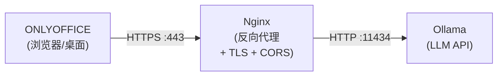

# 配置 Ollama 的 CORS

## 为本地请求配置 OLLAMA_ORIGINS

要启用来自本地应用程序和浏览器的请求的正确处理，您需要配置 `OLLAMA_ORIGINS` 环境变量，该变量定义允许的 Origin 标头值。

### 设置环境变量

:::note
必须在启动 Ollama 服务之前设置环境变量。如果 Ollama 已在运行，您必须在设置变量后重启它。
:::

#### Linux（systemd 服务）

大多数 Linux 安装将 Ollama 作为 systemd 服务运行。要配置环境变量：

```bash
sudo systemctl edit ollama
```

添加以下内容：

```ini
[Service]
Environment="OLLAMA_ORIGINS=http://*,https://*,onlyoffice://*"
```

应用更改：

```bash
sudo systemctl daemon-reload
sudo systemctl restart ollama
```

要验证变量是否已设置：

```bash
systemctl show ollama --property=Environment
```

#### Linux（手动启动）

如果不使用 systemd 手动运行 Ollama：

```bash
export OLLAMA_ORIGINS=http://*,https://*,onlyoffice://*
ollama serve
```

#### macOS

macOS 上的 Ollama 作为独立应用程序运行。有几种设置环境变量的方法：

**选项 1：使用 launchctl（推荐）**

```bash
launchctl setenv OLLAMA_ORIGINS "http://*,https://*,onlyoffice://*"
```

设置变量后，退出并重启 Ollama 应用程序。

**选项 2：添加到 shell 配置文件**

添加到 `~/.zshrc` 或 `~/.bash_profile`：

```bash
export OLLAMA_ORIGINS=http://*,https://*,onlyoffice://*
```

然后从新的终端会话重启 Ollama 应用程序。

#### Windows

**PowerShell（仅当前会话）：**

```powershell
$env:OLLAMA_ORIGINS = "http://*,https://*,onlyoffice://*"
ollama serve
```

**PowerShell（永久，需要新会话）：**

```powershell
setx OLLAMA_ORIGINS "http://*,https://*,onlyoffice://*"
```

使用 `setx` 后，关闭并重新打开 PowerShell，然后启动 Ollama。

#### Docker

```bash
docker run -d \
  -e OLLAMA_ORIGINS="http://*,https://*,onlyoffice://*" \
  -p 11434:11434 \
  -v ollama:/root/.ollama \
  ollama/ollama
```

### 值说明

- `http://*` - 允许来自任何 HTTP 域的请求
- `https://*` - 允许来自任何 HTTPS 域的请求
- `onlyoffice://*` - 允许来自 ONLYOFFICE 嵌入式 WebView 的请求（用于 AI 插件功能）

### 验证 CORS 配置

配置环境变量并启动 Ollama 后，您可以验证服务器响应中是否存在 CORS 标头：

```bash
curl -v -X OPTIONS http://localhost:11434/api/tags \
  -H "Origin: http://localhost:3000" \
  -H "Access-Control-Request-Method: GET"
```

预期响应应包含以下标头：

```
HTTP/1.1 204 No Content
Access-Control-Allow-Origin: http://localhost:3000
Access-Control-Allow-Methods: GET, POST, OPTIONS
Access-Control-Allow-Headers: Content-Type, Authorization
Access-Control-Allow-Credentials: true
```

使用 GET 请求的替代验证方法：

```bash
curl -v http://localhost:11434/api/tags \
  -H "Origin: http://localhost:3000"
```

响应应包含与指定 Origin 匹配的 `Access-Control-Allow-Origin` 标头。

### 使用场景

- 带 AI 插件的 ONLYOFFICE 桌面版
- 不同端口/主机上的本地 Web 应用
- 与 Ollama API 交互的 Electron/React 应用

### 安全建议

使用通配符值（`*`）会开放来自所有域的 API 访问，不建议用于公共服务器。对于生产环境，请指定明确的域：

```bash
OLLAMA_ORIGINS=http://localhost:3000,https://ollama.example.com
```

---

## 为通过 SSL 的网络请求配置 OLLAMA_ORIGINS

要接受来自网络上其他机器通过 HTTPS 协议的请求，需要以下配置。

### 网络接口配置

:::note
这些环境变量必须在启动 Ollama 服务之前设置。
:::

默认情况下，Ollama 仅在 localhost 上监听。要启用网络访问，请指定：

#### Linux（systemd）

```bash
sudo systemctl edit ollama
```

```ini
[Service]
Environment="OLLAMA_ORIGINS=http://*,https://*,onlyoffice://*"
Environment="OLLAMA_HOST=0.0.0.0"
```

```bash
sudo systemctl daemon-reload
sudo systemctl restart ollama
```

#### Linux（手动）/ macOS

```bash
export OLLAMA_HOST=0.0.0.0
export OLLAMA_PORT=11434
```

#### Docker

```bash
docker run -d \
  -e OLLAMA_ORIGINS="https://*" \
  -e OLLAMA_HOST="0.0.0.0" \
  -p 11434:11434 \
  -v ollama:/root/.ollama \
  ollama/ollama
```

:::warning
此配置将 API 暴露给整个网络。必须采取额外的安全措施（反向代理、身份验证）。
:::

### 配置允许的 SSL 来源

:::note
`OLLAMA_ORIGINS` 变量必须在启动 Ollama 服务之前设置。
:::

对于从其他域/服务器上的 Web 界面访问，例如 `https://ollama-ui.my.local`：

```bash
export OLLAMA_ORIGINS=https://ollama-ui.my.local,https://ui.example.org
```

使用通配符的替代方法：

```bash
export OLLAMA_ORIGINS=https://*
```

### 启动服务

```bash
ollama serve
```

或使用明确的参数：

```bash
ollama serve --host 0.0.0.0 --port 11434
```

### 重要安全说明

在没有额外保护的情况下通过公共 IP/HTTPS 直接访问 Ollama 存在重大安全风险。建议使用带有 TLS 终止和身份验证机制的反向代理。

---

## Nginx 配置作为 HTTPS 反向代理

此配置通过 Nginx 提供对 Ollama API 的安全 HTTPS 访问及 CORS 支持。

### 要求

- 已安装 Nginx
- 有效的 SSL 证书（Let's Encrypt 或其他 CA）
- 在端口 11434 上运行的 Ollama 实例

### 基本 Nginx 配置

```nginx
# Redirect HTTP to HTTPS
server {
    listen 80;
    server_name ollama.example.com;
    return 301 https://$host$request_uri;
}

# Main HTTPS server
server {
    listen 443 ssl;
    server_name ollama.example.com;

    ssl_certificate /etc/letsencrypt/live/ollama.example.com/fullchain.pem;
    ssl_certificate_key /etc/letsencrypt/live/ollama.example.com/privkey.pem;

    # SSL settings
    ssl_protocols TLSv1.2 TLSv1.3;
    ssl_prefer_server_ciphers on;

    # Handle preflight OPTIONS requests
    if ($request_method = OPTIONS) {
        add_header 'Access-Control-Allow-Origin' '*' always;
        add_header 'Access-Control-Allow-Credentials' 'true' always;
        add_header 'Access-Control-Allow-Headers' 'Authorization,Origin,Accept,Content-Type' always;
        add_header 'Access-Control-Allow-Methods' 'GET,POST,OPTIONS' always;
        return 204;
    }

    location / {
        proxy_pass http://localhost:11434;

        add_header 'Access-Control-Allow-Origin' '*' always;
        add_header 'Access-Control-Allow-Credentials' 'true' always;
        add_header 'Access-Control-Allow-Headers' 'Authorization,Origin,Accept,Content-Type' always;
        add_header 'Access-Control-Allow-Methods' 'GET,POST,OPTIONS' always;

        proxy_set_header Host $host;
        proxy_set_header X-Real-IP $remote_addr;
        proxy_set_header X-Forwarded-For $proxy_add_x_forwarded_for;
        proxy_set_header X-Forwarded-Proto $scheme;

        proxy_http_version 1.1;
        proxy_set_header Upgrade $http_upgrade;
        proxy_set_header Connection "upgrade";

        proxy_read_timeout 300s;
        proxy_connect_timeout 75s;
        
        proxy_buffering off;
    }
}
```

### 重要配置方面

- **带 `always` 标志的 CORS 标头**对于来自 ONLYOFFICE 和其他浏览器客户端的正确跨域请求处理是必需的。
- **`proxy_read_timeout` 参数**增加到 300 秒以处理语言模型的长时间运行操作。
- **SSL/TLS 加密**确保网络 API 访问期间的流量保护。
- **WebSocket 支持**对于模型的实时流式响应功能是必要的。
- **禁用缓冲**（`proxy_buffering off`）允许流式响应立即发送给客户端。

---

## 故障排除

### 设置了环境变量但 CORS 不工作

**症状：** 您设置了 `OLLAMA_ORIGINS`，但请求仍然因 CORS 错误而失败。

**解决方案：** 设置环境变量后必须重启 Ollama 服务。

### CORS 在 curl 中有效但在浏览器中无效

**症状：** `curl` 请求成功，但浏览器请求失败。

**可能原因：**
1. 浏览器发送的 `Origin` 标头与允许的来源不匹配
2. 浏览器缓存了之前失败的 CORS 响应

**解决方案：**
1. 检查浏览器开发者工具（网络选项卡）以查看发送的确切 `Origin`
2. 清除浏览器缓存或在无痕模式下测试
3. 确保 `OLLAMA_ORIGINS` 包含确切的来源（协议 + 域名 + 端口）

### 端口 11434 连接被拒绝

**症状：** 无法从另一台机器连接到 Ollama。

**解决方案：**
1. 确保设置了 `OLLAMA_HOST=0.0.0.0`（不仅仅是 localhost）
2. 检查防火墙规则：
   ```bash
   sudo ufw allow 11434/tcp
   ```
3. 验证 Ollama 是否在所有接口上监听：
   ```bash
   ss -tlnp | grep 11434
   ```

### 流式响应不工作

**症状：** 响应一次性全部到达而不是流式传输。

**解决方案：**
1. 在 Nginx location 块中添加 `proxy_buffering off;`
2. 确保配置了 WebSocket 标头：
   ```nginx
   proxy_http_version 1.1;
   proxy_set_header Upgrade $http_upgrade;
   proxy_set_header Connection "upgrade";
   ```

---

## 解决方案架构



组件交互遵循此方案：
- ONLYOFFICE UI 通过 HTTPS 协议连接到 Nginx
- Nginx 作为反向代理处理 CORS 并将请求转发到端口 11434 上的本地 Ollama 实例
- Nginx 提供 TLS 终止和访问控制
- `OLLAMA_ORIGINS` 变量控制允许的请求来源
- ONLYOFFICE AI 插件使用安全的 HTTPS 端点连接到语言模型
